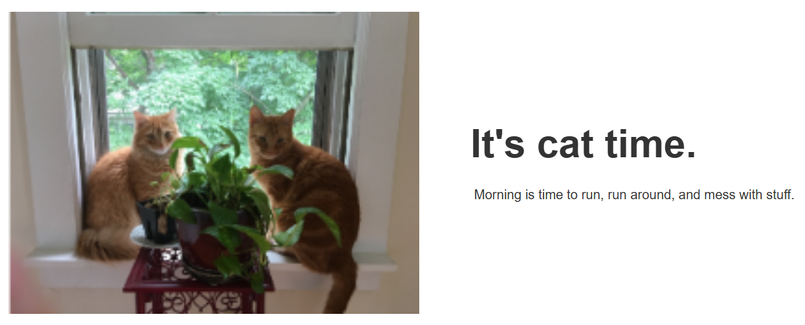

# Hero Banner Module

A custom Hero Banner module built for HubSpot CMS using HubL. This module demonstrates responsive design, editable content, dynamic styling, and image optimization.

---

## Preview



---

## Features

- ✅ Editable Heading
- ✅ Editable Description
- ✅ CTA Button
- ✅ Button Link
- ✅ Hero Image Upload
- ✅ Responsive Design
- ✅ Dynamic Style Fields
- ✅ Optimized Images using `resize_image_url()`
- ✅ Uses `require_css` and `scope_css`

---

## Folder Structure

```
hero-banner-module/
│
├── module.html
├── module.css
├── fields.json
├── meta.json
├── hero_banner.png
└── README.md
```

---

## Create the Module in HubSpot

1. Open **HubSpot**.
2. Go to **Content → Design Manager**.
3. Click **File → New File**.
4. Select **Module**.
5. Choose **Custom Module**.
6. Name it **Hero Banner Module**.
7. Replace the generated files with the code from this repository.

---

## Create Module Fields

Create the following fields in `fields.json` or using the Module Editor.

| Field | Type |
|--------|------|
| Heading | Text |
| Description | Rich Text |
| Button Text | Text |
| Button Link | Link |
| Button Color | Color |
| Hero Image | Image |

---

## Add the Module to a Page

1. Open your page template.
2. Drag the **Hero Banner Module** onto the page.
3. Configure:
   - Heading
   - Description
   - Button
   - Image
4. Publish the page.

---

## Technologies Used

- HubSpot CMS
- HubL
- HTML5
- CSS3
- Responsive Design

---

## Skills Demonstrated

- HubSpot CMS Module Development
- HubL Templating
- Responsive Web Design
- Dynamic Fields
- `fields.json`
- `meta.json`
- `require_css`
- `scope_css`
- `resize_image_url()`

---

## Author

**Kalpana Sharma**

- LinkedIn: https://www.linkedin.com/in/skalpana/
- Portfolio: https://go1digital.com/startup-portfolio/
