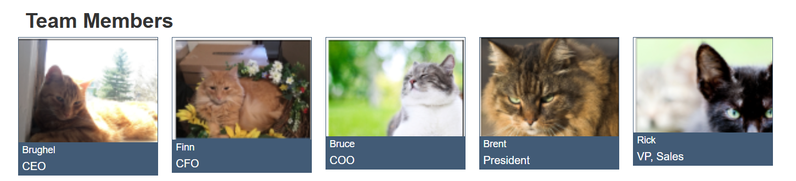

# Team Members Module

A reusable **Team Members Module** built for **HubSpot CMS** using **HubL, HTML5, and CSS3**. This module allows content editors to easily add and manage unlimited team members using a **Repeater Field**, making it ideal for About Us, Leadership, and Team pages.

---

## 📸 Preview



---

# ✨ Features

- Responsive Team Members Grid
- Repeater Field for Unlimited Team Members
- Team Member Photo
- Name
- Designation
- Description
- Responsive Card Layout
- Beginner Friendly
- Easy to Customize

---

# 📂 Folder Structure

```text
team-members-module/
│
├── README.md
├── module.html
├── module.css
├── fields.json
└── team_members_preview.png
```

---

# 🚀 Getting Started

Follow these steps to create this module in HubSpot CMS.

---

## Step 1 – Create a Custom Module

1. Login to your HubSpot Account.
2. Navigate to **Content → Design Manager**.
3. Click **File → New File**.
4. Select **Module**.
5. Choose **Custom Module**.
6. Name it **Team Members Module**.
7. Click **Create**.

---

## Step 2 – Create Module Fields

Create the following fields in the Module Editor.

| Field Name | Field Type |
|------------|------------|
| Section Title | Text |
| Team Members | Repeater (Group) |
| Photo | Image |
| Name | Text |
| Designation | Text |
| Description | Rich Text |

> **Tip:** The Repeater field allows editors to add unlimited team members without changing the module code.

---

## Step 3 – Add the Module Code

Replace the default generated files with the files from this repository.

- module.html
- module.css
- fields.json

Save the module.

---

## Step 4 – Add the Module to a Page

1. Open a HubSpot Page or Template.
2. Drag the **Team Members Module** onto the page.
3. Enter the Section Title.
4. Click **Add Team Member**.
5. Upload the team member's photo.
6. Enter:
   - Name
   - Designation
   - Description
7. Repeat the process for additional team members.
8. Publish the page.

---

# 📋 Expected Output

The module displays a responsive Team Members section containing:

- Team Member Photo
- Name
- Designation
- Description
- Responsive Card Layout
- Unlimited Team Members using a Repeater Field

---

# 💼 Use Cases

This module is suitable for:

- About Us Page
- Meet Our Team Page
- Leadership Section
- Agency Website
- Startup Website
- Company Profile
- Employee Directory

---

# 🛠 Technologies Used

- HubSpot CMS
- HubL
- HTML5
- CSS3
- Responsive Web Design

---

# 📚 Skills Demonstrated

- HubSpot CMS Module Development
- HubL Templating
- Repeater Fields
- Dynamic Content
- Responsive Grid Layout
- Conditional Rendering
- `resize_image_url()`
- Clean Module Structure

---

# 👩‍💻 Author

**Kalpana Sharma**

- **LinkedIn:** https://www.linkedin.com/in/skalpana/
- **Portfolio:** https://go1digital.com/startup-portfolio/

---

## ⭐ If you found this project helpful, consider giving it a star on GitHub!
