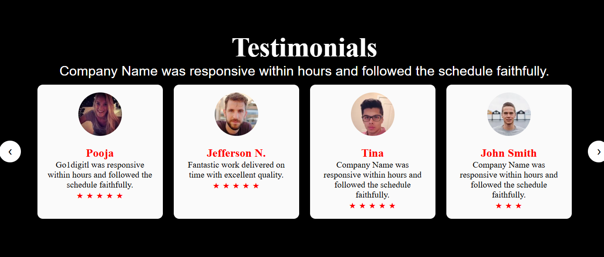
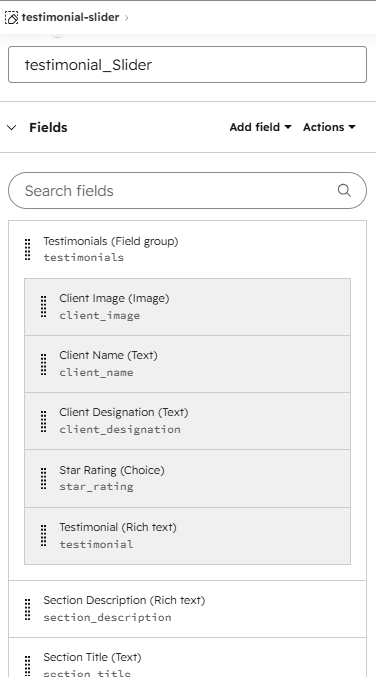
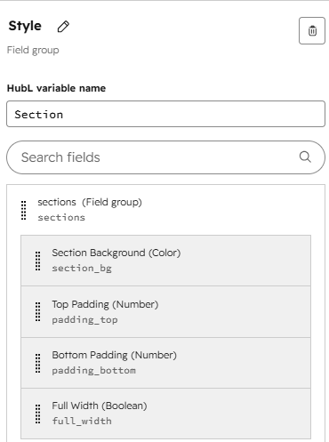
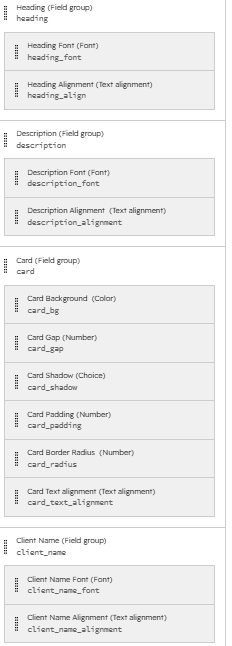
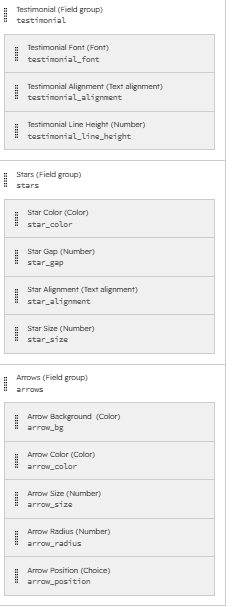

# Responsive Testimonial Slider | HubSpot CMS Custom Module

A fully responsive **HubSpot CMS Custom Module** built using **HubL, HTML5, CSS3, and JavaScript**. This reusable module allows content editors to manage testimonials while giving marketers complete control over the design using the HubSpot **Style** tab.

---

# Module Preview



---

# Features

- Fully Responsive Testimonial Slider
- Built with HubSpot CMS & HubL
- Dynamic Style Tab Controls
- Client Image
- Client Name
- Client Designation
- Star Rating
- Rich Text Testimonials
- Previous & Next Navigation
- Reusable Custom Module
- Easy Content Management using Repeater Fields
- Mobile Friendly
- No External Libraries Required

---

# Folder Structure

```text
testimonial-slider/
│
├── README.md
├── module.html
├── module.css
├── module.js
├── fields.json
├── meta.json
├── module.json
│
└── screenshot/
    ├── testimonial_slider.png
    ├── fields.png
    ├── style_group_1.png
    ├── style_group_2.png
    └── style_group_3.png
```

---

# Module Files

| File | Description |
|------|-------------|
| module.html | HubL markup and dynamic CSS |
| module.css | Layout and responsive styling |
| module.js | Testimonial slider functionality |
| fields.json | Module field configuration |
| meta.json | Module metadata |
| module.json | HubSpot module configuration |

---

# Content Fields

The module contains the following content fields.

## Content Configuration



### Main Fields

| Field | Type | Description |
|--------|------|-------------|
| Section Title | Text | Displays the section heading |
| Section Description | Rich Text | Displays the section description |
| Testimonials | Repeater | Stores all testimonials |

### Repeater Fields

Each testimonial includes:

| Field | Type |
|--------|------|
| Client Image | Image |
| Client Name | Text |
| Client Designation | Text |
| Star Rating | Choice |
| Testimonial | Rich Text |

---

# Style Configuration

The module provides complete design customization through the HubSpot **Style** tab.

---

## Section, Heading & Description



### Section

- Background Color
- Top Padding
- Bottom Padding
- Full Width Option

### Heading

- Font Family
- Font Size
- Font Weight
- Font Style
- Font Color
- Text Alignment

### Description

- Font Family
- Font Size
- Font Weight
- Font Style
- Font Color
- Text Alignment

---

## Card & Client Name



### Card

- Background Color
- Card Gap
- Card Shadow
- Card Padding
- Border Radius
- Text Alignment

### Client Name

- Font Family
- Font Size
- Font Weight
- Font Style
- Font Color
- Text Alignment

---

## Designation, Testimonial, Stars & Navigation



### Designation

- Font Family
- Font Size
- Font Weight
- Font Style
- Font Color
- Text Alignment

### Testimonial

- Font Family
- Font Size
- Font Weight
- Font Style
- Font Color
- Text Alignment
- Line Height

### Stars

- Star Color
- Star Size
- Star Gap
- Star Alignment

### Navigation Arrows

- Background Color
- Arrow Color
- Arrow Size
- Border Radius
- Arrow Position

---

# Responsive Layout

| Device | Cards Displayed |
|---------|-----------------|
| Desktop | 4 |
| Tablet | 2 |
| Mobile | 1 |

---

# Technologies Used

- HubSpot CMS
- HubL
- HTML5
- CSS3
- JavaScript
- Responsive Design

---

# Installation

### Step 1

Open **HubSpot Design Manager**

```
Marketing
   ↓
Files and Templates
   ↓
Design Manager
```

---

### Step 2

Create a new **Custom Module**.

---

### Step 3

Add the following files.

```
module.html
module.css
module.js
```

---

### Step 4

Import or recreate the fields shown in **Content Fields** and **Style Configuration** using the screenshots above.

---

### Step 5

Publish the module.

---

### Step 6

Drag the module into any HubSpot page or template.

---

# Customization

Using the **Style** tab, editors can customize:

- Section Background
- Section Padding
- Heading Typography
- Description Typography
- Card Background
- Card Gap
- Card Padding
- Card Border Radius
- Card Text Alignment
- Client Name Typography
- Designation Typography
- Testimonial Typography
- Star Styling
- Navigation Arrow Styling

No code changes are required.

---

# Browser Support

- Google Chrome
- Microsoft Edge
- Mozilla Firefox
- Safari

---

# Future Improvements

- Autoplay Option
- Infinite Loop
- Touch Swipe Support
- Pagination Dots
- Animation Speed Control
- Multiple Slider Layouts

---

# Author

**Kalpana Sharma**

HubSpot CMS Developer

- GitHub: https://github.com/kalpana-da
- LinkedIn: https://www.linkedin.com/in/skalpana

---

# License

This project is shared for learning, demonstration, and portfolio purposes.
